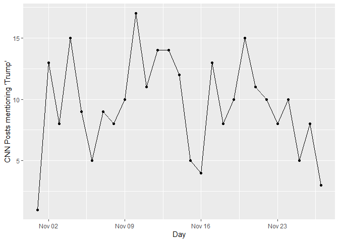

<!-- README.md is generated from README.Rmd. Please edit that file -->

# rtangle

<!-- badges: start -->

[](https://www.tidyverse.org/lifecycle/#experimental)
[](https://CRAN.R-project.org/package=ggecon)
<!-- badges: end -->

## Installation and Loading

``` r
devtools::install_github("schliebs/rtangle")
```

``` r
library(rtangle)
library(dplyr)
library(purrr)
```

## API Authentication

There are two options to set a CT API token and save it in the system
environment. The first one is to trigger an RStudio window opening, and
entering the token.

``` r
set_crowdtangle_token(option = "enter")
```

The second option is to store the CT token as a txt file in a secure
local location that is not synched with git or shared with other users.

``` r
set_crowdtangle_token(option = "txt",
                      tokenpath = "./nogit/confidential/CT_token.txt")
```

Now, when calling a function that uses the API, the token can be passed
by using `crowdtangle_token()` as an argument to the function.

``` r
crowdtangle_token()
```

## CT Post Search

With the `posts_search` wrapper, you can search posts, either globally
within the whole CT database, or within a limited set of `AccountIds` or
`ListIds`. Note that this endpoint is not available to all customers and
needs to be requested and approved by the CT team.

Currently, the following parameters are available withint post\_search

``` r
posts_search(
  token,
  accountTypes = NULL,
  and = NULL,
  brandedContent = "no_filter",
  count = 10,
  endDate = rtangle:::ct_now(),
  includeHistory = NULL,
  inAccountIds = NULL,
  inListIds = NULL,
  language = NULL,
  minInteractions = 0,
  minSubscriberCount = 0,
  not = NULL,
  notInAccountIds = NULL,
  notInLstIds = NULL,
  notInTitle = NULL,
  offset = 0,
  pageAdminTopCountry = NULL,
  platforms = NULL,
  searchField = "text_fields_and_image_text",
  searchTerm = "",
  startDate = NULL,
  sortBy = "date",
  timeframe = NULL,
  types = NULL,
  verified = "no_filter",
  verifiedOnly = "false",
  search10k = FALSE,
  boolean_allowed = FALSE,
  output_raw = TRUE
)
```

See further `help(posts_search)` for additional infomation on available
options and parameters.

As an example, we query the API for all posts made by CNN’s Facebook
page in November 2020 which contained the term ‘Trump’. We also limit
the results to posts on Facebook, and specify that our accoun has
elevated search priviledges, allowing us to pull 10,000 posts at a time.

``` r
cnn_postlist <- 
  posts_search(token = crowdtangle_token(),
               inAccountIds = "8323", #CNN CT ID obtained via `list_details()`
               searchTerm = "Trump",
               startDate = "2020-11-01T00:00:00",
               endDate = "2020-11-30T23:59:59",
               count = 10000,
               sortBy = 'date',
               platforms = 'facebook',
               search10k = T,
               boolean_allowed = T,
               output_raw = TRUE)
#> [1] "collecting posts"
#> [1] "try for the 1th time."
#> [1] "now collected 256 entries"
```

``` r
class(cnn_postlist)
#> [1] "list"
```

``` r
length(cnn_postlist)
#> [1] 256
```

``` r
cnn_postlist[[1]] %>% str()
#> List of 18
#>  $ platformId     : chr "5550296508_10161507602146509"
#>  $ platform       : chr "Facebook"
#>  $ date           : chr "2020-11-27 11:31:10"
#>  $ updated        : chr "2020-11-27 11:56:12"
#>  $ type           : chr "link"
#>  $ title          : chr "Analysis: Trump's loss dealt a blow to global populism. But the movement is still alive and kicking"
#>  $ caption        : chr "cnn.com"
#>  $ message        : chr "\"For four years, Donald Trump has been the world's standard-bearer for right-wing populism. The movement didn'"| __truncated__
#>  $ expandedLinks  :List of 1
#>   ..$ :List of 2
#>   .. ..$ original: chr "https://cnn.it/3la7e28"
#>   .. ..$ expanded: chr "https://www.cnn.com/2020/11/27/world/trump-election-defeat-populism-global-intl/index.html?utm_source=fbCNN&utm"| __truncated__
#>  $ link           : chr "https://cnn.it/3la7e28"
#>  $ postUrl        : chr "https://www.facebook.com/cnn/posts/10161507602146509"
#>  $ subscriberCount: int 34022492
#>  $ score          : num -1.44
#>  $ media          :List of 1
#>   ..$ :List of 5
#>   .. ..$ type  : chr "photo"
#>   .. ..$ url   : chr "https://external-sea1-1.xx.fbcdn.net/safe_image.php?d=AQB2btWlfvlo2Dd4&w=619&h=619&url=https%3A%2F%2Fcdn.cnn.co"| __truncated__
#>   .. ..$ height: int 619
#>   .. ..$ width : int 619
#>   .. ..$ full  : chr "https://external-sea1-1.xx.fbcdn.net/safe_image.php?d=AQAViJl0LunEsYCD&url=https%3A%2F%2Fcdn.cnn.com%2Fcnnnext%"| __truncated__
#>  $ statistics     :List of 2
#>   ..$ actual  :List of 10
#>   .. ..$ likeCount    : int 290
#>   .. ..$ shareCount   : int 54
#>   .. ..$ commentCount : int 206
#>   .. ..$ loveCount    : int 7
#>   .. ..$ wowCount     : int 6
#>   .. ..$ hahaCount    : int 36
#>   .. ..$ sadCount     : int 14
#>   .. ..$ angryCount   : int 79
#>   .. ..$ thankfulCount: int 0
#>   .. ..$ careCount    : int 0
#>   ..$ expected:List of 10
#>   .. ..$ likeCount    : int 403
#>   .. ..$ shareCount   : int 90
#>   .. ..$ commentCount : int 332
#>   .. ..$ loveCount    : int 43
#>   .. ..$ wowCount     : int 22
#>   .. ..$ hahaCount    : int 36
#>   .. ..$ sadCount     : int 37
#>   .. ..$ angryCount   : int 36
#>   .. ..$ thankfulCount: int 0
#>   .. ..$ careCount    : int 6
#>  $ account        :List of 11
#>   ..$ id                 : int 8323
#>   ..$ name               : chr "CNN"
#>   ..$ handle             : chr "cnn"
#>   ..$ profileImage       : chr "https://scontent-sea1-1.xx.fbcdn.net/v/t31.0-1/p200x200/12304053_10154246192721509_1897912583584847639_o.png?_n"| __truncated__
#>   ..$ subscriberCount    : int 34022492
#>   ..$ url                : chr "https://www.facebook.com/5550296508"
#>   ..$ platform           : chr "Facebook"
#>   ..$ platformId         : chr "5550296508"
#>   ..$ accountType        : chr "facebook_page"
#>   ..$ pageAdminTopCountry: chr "US"
#>   ..$ verified           : logi TRUE
#>  $ newId          : chr "8323|10161507602146509"
#>  $ id             : num 1.12e+11
```

## Parsing Posts

We can now parse the list of `CT Post` objects into an R data.frame:

``` r
cnn_df <- cnn_postlist %>% parse_posts()
```

``` r
names(cnn_df)
#>  [1] "platformId"                        "platform"                         
#>  [3] "date"                              "updated"                          
#>  [5] "type"                              "title"                            
#>  [7] "caption"                           "message"                          
#>  [9] "link"                              "postUrl"                          
#> [11] "subscriberCount"                   "score"                            
#> [13] "statistics.actual.likeCount"       "statistics.actual.shareCount"     
#> [15] "statistics.actual.commentCount"    "statistics.actual.loveCount"      
#> [17] "statistics.actual.wowCount"        "statistics.actual.hahaCount"      
#> [19] "statistics.actual.sadCount"        "statistics.actual.angryCount"     
#> [21] "statistics.actual.thankfulCount"   "statistics.actual.careCount"      
#> [23] "statistics.expected.likeCount"     "statistics.expected.shareCount"   
#> [25] "statistics.expected.commentCount"  "statistics.expected.loveCount"    
#> [27] "statistics.expected.wowCount"      "statistics.expected.hahaCount"    
#> [29] "statistics.expected.sadCount"      "statistics.expected.angryCount"   
#> [31] "statistics.expected.thankfulCount" "statistics.expected.careCount"    
#> [33] "account.id"                        "account.name"                     
#> [35] "account.handle"                    "account.profileImage"             
#> [37] "account.subscriberCount"           "account.url"                      
#> [39] "account.platform"                  "account.platformId"               
#> [41] "account.accountType"               "account.pageAdminTopCountry"      
#> [43] "account.verified"                  "newId"                            
#> [45] "id"                                "n_urls"                           
#> [47] "original_urls"                     "expanded_urls"                    
#> [49] "n_media"                           "media_type"                       
#> [51] "media_url"                         "media_height"                     
#> [53] "media_width"                       "description"                      
#> [55] "videoLengthMS"                     "liveVideoStatus"                  
#> [57] "imageText"
```

``` r
library(ggplot2)

cnn_by_day <- 
  cnn_df %>% 
  mutate(day = date %>% 
           lubridate::as_datetime() %>% 
           lubridate::round_date(unit = "day")) %>% 
  group_by(day) %>% 
  summarise(n = n())

ggplot(cnn_by_day,
       aes(x = day,
           y = n)) + 
  geom_line() + 
  geom_point() +
  labs(x = "Day",
       y = "CNN Posts mentioning 'Trump'")
```



## Link Search

t.b.c.

## Adaptive Time-Frame adjustment and Pagination

t.b.c.

## Additional Helper Functions made available via Namespace Export

### Adaptive Waiting and Sleeping to Respect API Limits

Continue script after 20:30:34 on November 14th 2020

``` r
continue_at <- lubridate::as_datetime("2020-11-14 20:30:34")
wait_till(resume = continue_at, seconds = 12)
```

Continue script 60 seconds after the last call was made:

``` r
last_timestamp <- lubridate::now()
# ... (Some function is executed)
wait_till(from = last_timestamp, seconds = 60)
```
